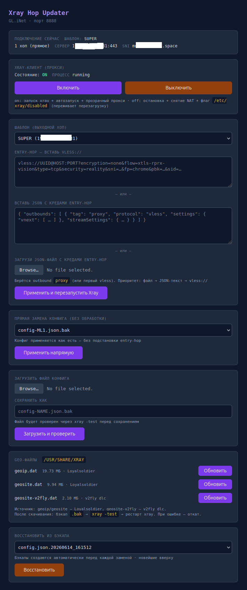

# Xray Hop Updater

Веб-панель на порту 8888 для управления Xray VLESS-прокси на роутерах
OpenWRT / GL.iNet — без правки конфигов по SSH. Поддерживает одно- и двухшаговые
(2-hop) цепочки.

> Клиент Xray → VLESS entry-hop → Xray exit-hop → Интернет



## Возможности

- **Применение шаблона + entry-hop** — подставляет промежуточный хоп в готовый
  шаблон exit-хопа и настраивает `dialerProxy`. Креды entry-hop можно задать
  тремя способами: строкой `vless://`, вставкой JSON-текста или загрузкой
  JSON-файла клиентского конфига.
- **Прямая замена конфига** — применить любой `.json.bak` как есть.
- **Загрузка файла конфига** с проверкой `xray -test` перед сохранением.
- **Списки доменов** — две textarea: заграничные ресурсы и российские. Панель
  дописывает их в **уже существующие** правила-списки конфига, помеченные
  `ruleTag` (`hop-list-foreign` / `hop-list-ru`), и не трогает ни `outboundTag`,
  ни порядок правил: куда ведёт лейн, решает сам конфиг. В прямом режиме
  `foreign → proxy`, `ru → direct` или `entry-hop`; в обратном (роутер за
  границей, выход в РФ) `foreign → direct`, `ru → proxy`. Поэтому один набор
  списков безопасно раскатывать на весь флот. Метки проставляются автоматически
  по опорным доменам списка, а старые правила `hop-ui-proxy` / `hop-ui-direct`
  (панель ставила их первыми, и они перекрывали нижние списки) вливаются в свой
  лейн и удаляются. Применяется разом к активному `config.json` и ко **всем
  шаблонам**; файл без опознанных списков пропускается со статусом `nolist`.
- **Раскатка списков на флот** — `push-lists.sh` дёргает тот же эндпоинт панели
  по HTTP на всех роутерах из `routers.conf`, так что бэкап и `xray -test`
  отрабатывают на каждом штатно.
- **Обновление geo-файлов** (`geoip.dat`, `geosite.dat`, `geosite-v2fly.dat`)
  кнопками — с бэкапом, валидацией и автоматическим откатом при ошибке.
- **Включение/выключение Xray-клиента** (если на роутере есть `proxy-toggle.sh`).
- **Бэкап и восстановление** — перед каждой заменой создаётся бэкап `config.json`.
- Любой конфиг валидируется через `xray -test` до применения.
- Статус показывает, сколько хопов активно (1 или 2) и параметры серверов.

## Требования

OpenWRT 21+, `uhttpd`, `lua` 5.1+, `lua-cjson`, установленный `xray`
(`/usr/bin/xray` + init-скрипт `/etc/init.d/xray`). Для обновления geo-файлов —
`curl` + `ca-certificates`. Подробности и проверки — в [DEPLOY.md](DEPLOY.md).

## Быстрый старт

```bash
# Установка панели на роутер (пароль по умолчанию admin:xray-hop)
./deploy.sh root@192.168.8.1

# Со своим паролем
./deploy.sh root@192.168.8.1 admin:mysecretpassword
```

После установки открой `http://<IP-роутера>:8888`. Шаблоны конфигов
(`config-*.json.bak`) положи в `/etc/xray/` на роутере — они специфичны для твоей
связки серверов и **в репозиторий не входят**.

Полная инструкция (ручная установка, структура шаблонов, geo-файлы,
toggle-режим, смена пароля) — в **[DEPLOY.md](DEPLOY.md)**.

## Состав

| Файл | Назначение |
|---|---|
| `update-hop.lua` | CGI-скрипт панели (главный файл) |
| `deploy.sh` | автоматическая установка на роутер |
| `push-lists.sh` | раскатка списков доменов на все роутеры через панель |
| `routers.conf.example` | шаблон списка роутеров для `push-lists.sh` |
| `lists/*.example` | шаблоны списков доменов (`foreign.txt`, `ru.txt`) |
| `proxy-toggle.sh` | вкл/выкл Xray-клиента (ставится вручную) |
| `hop-ui/index.html` | редирект `http://router:8888/` на страницу |
| `DEPLOY.md` | подробная инструкция |

## Безопасность

Панель доступна только из LAN (порт 8888 закрыт со стороны WAN стандартными
правилами OpenWRT) и защищена HTTP Basic Auth. **Не коммить** реальные конфиги
с UUID/ключами — `.gitignore` уже исключает `config-*.json.bak`, `*.json`,
`hop-auth` и выгрузки кредов.

## Лицензия

[MIT](LICENSE)
